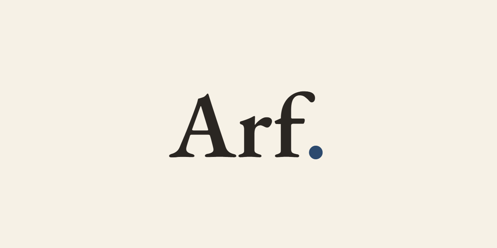
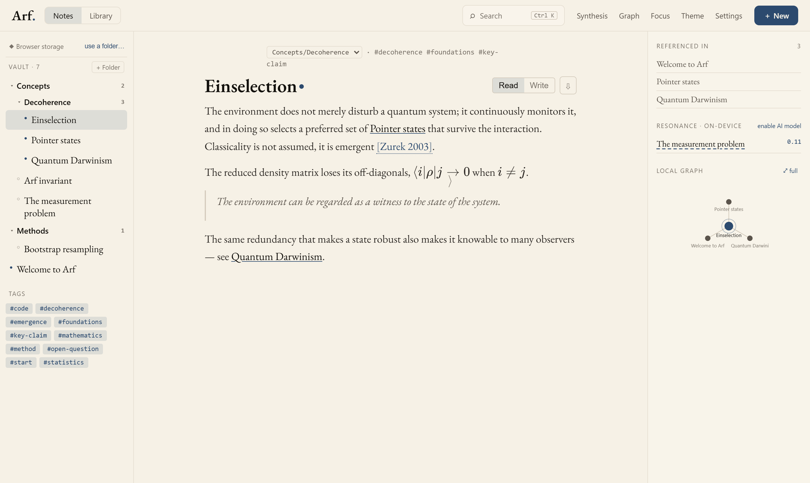
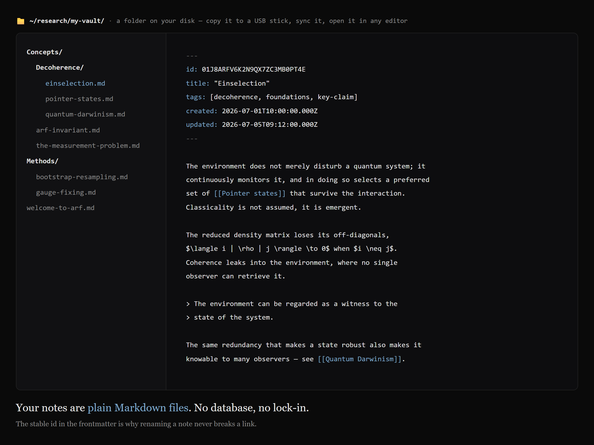
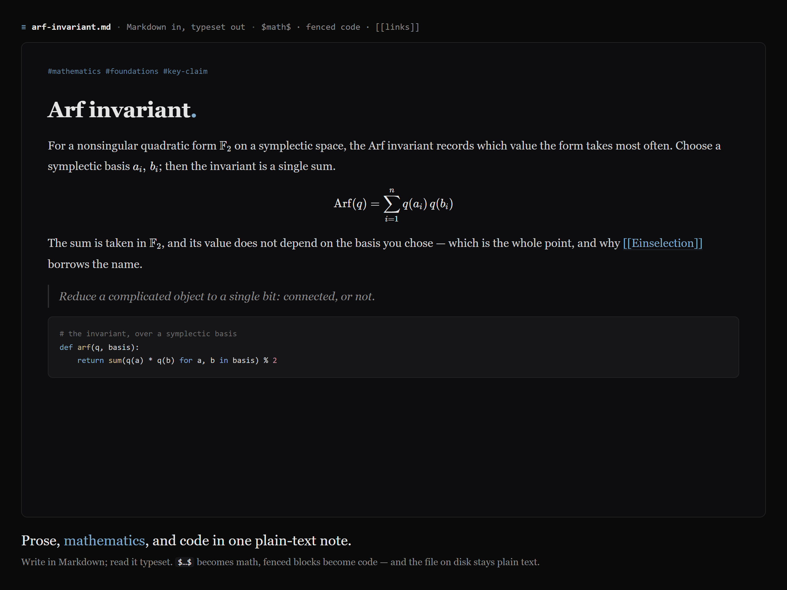
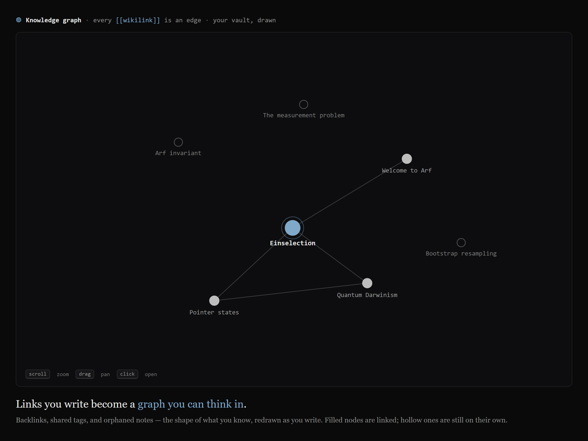
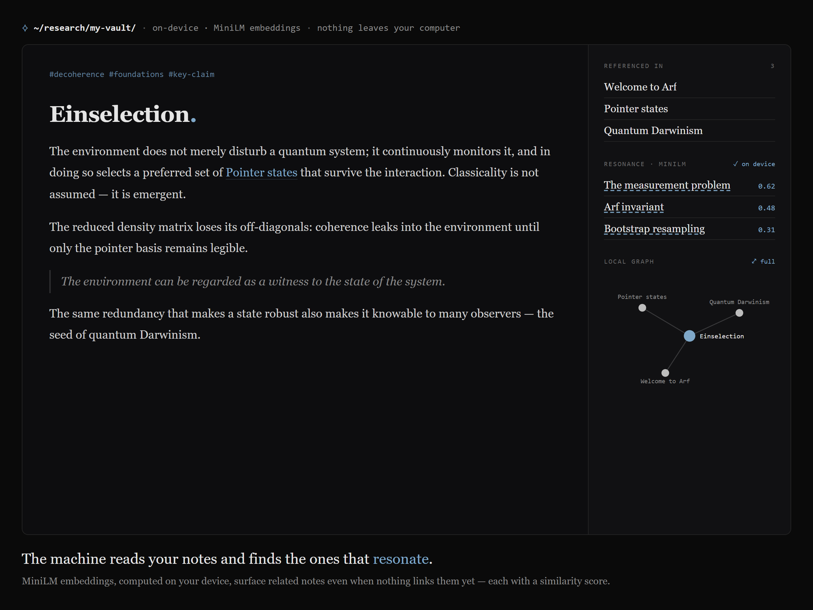

<p align="center">
  <picture>
    <source media="(prefers-color-scheme: dark)" srcset="banner-dark.png">
    
  </picture>
</p>

<p align="center">
  A local-first second brain for scientists and coders.<br>
  Write notes, link them, and let a private on-device model surface the connections you didn't draw.
</p>

<p align="center">
  <a href="https://github.com/tunabirgun/arf/releases/latest"></a>
  <a href="LICENSE"></a>
  
  <a href="https://huggingface.co/sentence-transformers/all-MiniLM-L6-v2"></a>
</p>

<p align="center">
  <a href="https://github.com/tunabirgun/arf/releases/latest"><b>Download</b></a>&nbsp;&nbsp;·&nbsp;&nbsp;<a href="https://tunabirgun.github.io/arf/"><b>Documentation</b></a>&nbsp;&nbsp;·&nbsp;&nbsp;<a href="https://youtu.be/0ClY352euog"><b>Teaser</b></a>
</p>

<p align="center">
  
</p>

Your notes are plain Markdown files you own, and nothing leaves your device.

## Why Arf

Note collections rarely fail because capture was too hard. They fail because notes pile up faster than anyone connects them, and the insight that was supposed to emerge stays buried. Arf is built to fight that: it keeps your writing in plain files you control, and runs a small model on your own machine that notices when two of your thoughts belong together.

It is named after the mathematician Cahit Arf, whose Arf invariant reduces a complicated object to a single bit — connected, or not. Every note in Arf carries that mark: a filled dot when it has links, a hollow one while it is still an orphan.

## A look inside

<table>
<tr>
<td width="50%"><br><sub><b>Plain files.</b> A folder on your disk — copy it, sync it, open it in any editor.</sub></td>
<td width="50%"><br><sub><b>One note.</b> Prose, typeset math, and code in one plain-text file.</sub></td>
</tr>
<tr>
<td width="50%"><br><sub><b>The graph.</b> Every <code>[[wikilink]]</code> is an edge; orphans stand alone.</sub></td>
<td width="50%"><br><sub><b>Resonance.</b> On-device embeddings surface related notes you never linked.</sub></td>
</tr>
</table>

<p align="center"><a href="https://tunabirgun.github.io/arf/"><b>Take the tour →</b></a></p>

## Features

- **Write** in Markdown, with LaTeX math and syntax-highlighted code. The formatting toolbar inserts real Markdown — headings, bold, italic, strikethrough, inline code, links, bullet/numbered/task lists, quotes, code blocks, and dividers — and lists continue when you press Enter. Tick task checkboxes right in the reading view, paste or drop in images, and edit a note's tags above its title.
- **Link** notes with `[[wikilinks]]`; backlinks and concept `#tags` build themselves. Links resolve by a stable id, so renaming a note never breaks them.
- **See** your knowledge as a graph: a local view beside each note and a full-window view of the whole vault, with scroll-to-zoom, drag-to-pan, and Ctrl-click multi-select. It reads in ink — node size grows with links, filled circles have connections, hollow ones are orphans, dashed edges are the model's suggestions.
- **Discover** with the on-device model. **Resonance** surfaces notes similar to the one you are reading; the weekly **Synthesis** digest points out pairs that belong together but were never linked, and shows the concepts they share so you can see the connection at a glance.
- **Read your language.** The default embedding model reads English; Settings offers a multilingual model (~120 MB) that understands 50+ languages, including Turkish. A suggested connection is written in the note's own language — native phrasing for English, Turkish, German, French, Spanish, and Italian.
- **Cite** from the **Library**. References are fetched live from Crossref and Open Library by DOI, ISBN, or arXiv ID, cited in notes with `[@citekey]` that jump to the reference, and exported to BibTeX, RIS, CSL-JSON, formatted styles (APA, Nature), and Zenodo. Insert a citation from the editor with the `@` picker, organize references into folders, and optionally append an end-of-note bibliography in the style you choose. Two works by the same author in one year are disambiguated automatically (Author 1981a / 1981b).
- **Own your data.** Your notes are plain Markdown files in a folder you choose at first launch. Keep that folder in Dropbox, iCloud, OneDrive, Syncthing, or a Git repo and Arf keeps it in step continuously, both ways. Back up the whole workspace as one `.arf` file, and export any note to Markdown, HTML, or PDF.
- **Make it yours.** Light and dark themes on a warm ink-on-paper palette, an adjustable view zoom, a distraction-free Focus mode, resizable sidebars, and a `Ctrl/⌘+K` command palette.

## Open, by principle

Arf is free and MIT-licensed, and its privacy is not a promise — it is something you can check. The model runs on your machine because the code that loads it is in this repository; your notes stay yours because there is no server in the tree to send them to. Nothing here phones home, and you can read every line that proves it. Fork it, audit it, file an issue, or build your own from it.

## Private by construction

The model runs on your device — through the GPU where there is one, the CPU otherwise. Your notes are never uploaded, there is no account, and there is no server that could read them. Only the public model file (~23 MB, or ~120 MB for the multilingual option) is fetched once and cached. Privacy here is not a policy you have to trust; it is the architecture.

## Build from source

Arf is a [Tauri 2](https://tauri.app) desktop app. You need [Node.js](https://nodejs.org) 18+, the [Rust toolchain](https://rustup.rs), and, on Windows, the MSVC C++ build tools.

```bash
npm install
npm run tauri dev      # run the desktop app against the Vite dev server
npm run tauri build    # installers → src-tauri/target/release/bundle/
```

Pushing a `v*` tag builds Windows, macOS, and Linux installers automatically and attaches them to a GitHub Release.

## Built with

Svelte 5 + Vite, CodeMirror 6, KaTeX, marked, DOMPurify, MiniSearch, [Transformers.js](https://github.com/huggingface/transformers.js) (all-MiniLM-L6-v2 and paraphrase-multilingual-MiniLM-L12-v2), and Tauri 2 for the desktop app.

## License

[MIT](LICENSE) © Tuna Birgün
